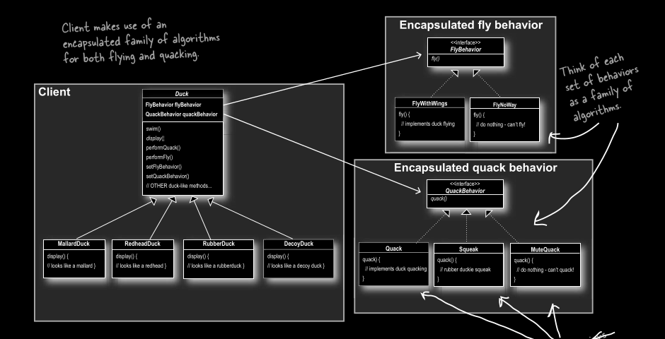
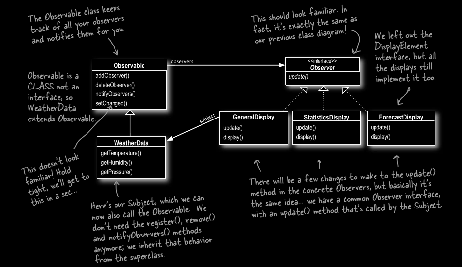
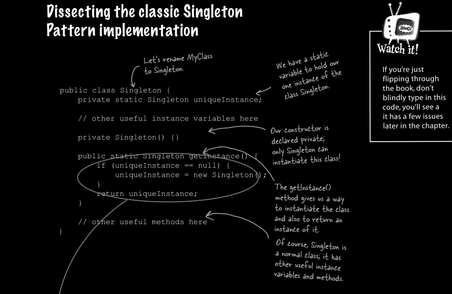

#### take the parts
#### that vary and encapsulate them, so that later you can
#### alter or extend the parts that vary without affecting
#### those that don’t.

## strategy pattern

## observer pattern

## decorator pattern

## factory pattenr

## Singlation Pattern

